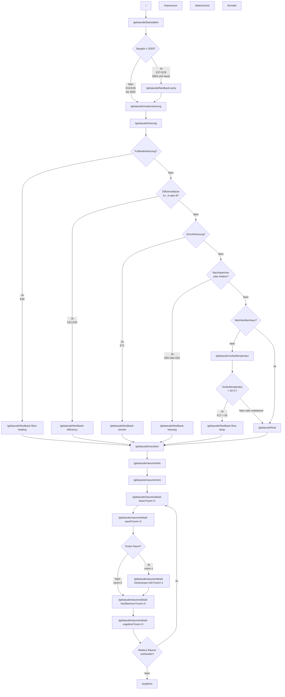

# UBA Wärmepumpen-Tool

Ein Online-Beratungstool für die Wärmepumpen-Eignung von Gebäuden.

## Projektübersicht

Das Wärmepumpen-Tool ist eine webbasierte Anwendung zur Analyse und Bewertung der Eignung von Gebäuden für Wärmepumpen. 
Es werden Gebäudeinformationen, Raumdaten und Heizkörperinformationen erfasst, um passende Wärmepumpen-Empfehlungen zu geben.

## Technische Details

- Framework: Angular 19.2.9 (mit Angular Elements 20.3.1)
- UI-Framework: Bootstrap 5.3.5 mit Bootstrap Icons 1.11.3
- Build-System: Angular CLI 19.2.10
- Deployment: Statische Single-Page Application (SPA)

## Komponenten und Struktur

Das Tool folgt einem Wizard-Ansatz mit folgenden Hauptabschnitten:

1. Gebäude: Erfassung allgemeiner Gebäudedaten
2. Räume: Eingabe von raumspezifischen Daten
3. Ergebnis: Auswertung

## Entwicklungsumgebung einrichten

### Voraussetzungen

- Node.js (v20 oder höher)
- npm
- LibreOffice (für Excel-Konvertierung)

### Installation

1. Repository klonen:
   ```bash
   git clone https://github.com/.../uba-waermepumpen.git
   cd uba-waermepumpen
   ```

2. Abhängigkeiten installieren:
   ```bash
   npm install
   ```

3. Entwicklungsserver starten:
   ```bash
   npm start
   ```
   Die Anwendung ist dann unter `http://localhost:4200/` erreichbar.

## Build und Deployment

### Produktions-Build

```bash
npm run build
```

Die Build-Artefakte werden im `dist/uba-waermepumpen/` Verzeichnis erstellt.

Alternativ kann der gesamte Build-Prozess mit dem build.sh Script ausgeführt werden, welches zusätzlich Version-Informationen in die Build-Dateien einfügt:

```bash
./build.sh
```

## Projektstruktur

### Zentrale Services
- `src/app/berechnung.service.ts`: Zentraler Datenmanagement-Service mit DataGrid-Architektur
- `src/app/data-grid.ts`: Excel-kompatible Calculation Engine mit Sheets/Cells/Formeln
- `src/app/custom-local-storage.service.ts`: Erweiterte localStorage mit Type Safety

### Formula Calculation System
- `src/app/formula-overlays/index.ts`: Zentrale Registry für alle Formula Overlays zum DataGrid
- `src/app/formula-overlays/base-overlay.ts`: Base Class und Utilities für Formula Overlays
- `src/app/formula-overlays/*-overlay.ts`: Excel-Formel-Implementierung pro Sheet

### Component Architecture
- `src/app/gebaeude/`: Gebäudedaten-Erfassung Components
  - Hauptformulare:
    - `gebaeude-basic/`: Grundlegende Gebäudeinformationen
    - `gebaeude-retrofitting/`: Gebäudesanierung Details
    - `gebaeude-heating/`: Heizsystem-Konfiguration
    - `gebaeude-flow-temp/`: Vorlauftemperatur-Einstellungen
  - Feedback-Seiten (bedingte Navigation):
    - `gebaeude-feedback-early/`: Feedback für neuere Gebäude (ab 2003)
    - `gebaeude-feedback-efficiency/`: Feedback für hohe Effizienzklassen
    - `gebaeude-feedback-einrohr/`: Feedback für Einrohrheizung
    - `gebaeude-feedback-floor-heating/`: Feedback für Fußbodenheizung
    - `gebaeude-feedback-flow-temp/`: Feedback für niedrige Vorlauftemperatur
    - `gebaeude-feedback-heating/`: Feedback für Nachtspeicher/Andere
  - Navigation:
    - `gebaeude-final/`: Abschluss Gebäudeerfassung
    - `gebaeude-transition/`: Übergang zu Raumerfassung
- `src/app/raeume/`: Raumdaten-Erfassung
  - `raeume-intro/`: Raum-Erfassung Einführung
  - `raeume-list-consolidated/`: Konsolidierte Raum-Auswahl
  - `raum-detail-basic/`: Raum-Grunddaten
  - `raum-detail-walls/`: Wände und Wärmeverluste
  - `raum-detail-heizflaechen/`: Heizflächen-Erfassung
  - `raum-detail-heizkoerper-info/`: Heizkörper-Informationen
  - `raum-detail-ergebnis/`: Raum-Ergebnis
- `src/app/ergebnis/`: Ergebnis-Components
  - `ergebnis-assessment/`: Wärmepumpen-Eignungsbewertung
- `src/app/shared/`: Wiederverwendbare UI Components
  - `wizard-tabs/`: Hauptnavigation mit Progress Indicators
  - `band-tacho/`: Gauge Visualization Component
  - `heater-form/`: Heizelement Configuration Form
  - `svg-icon/`: SVG Icon Rendering Component
  - `debug-overlay/`: Development Debugging Interface

### Auto-Generated Excel Data (WP_Check_Methode_v1_ts_export/)
- `master.ts`: Central Export aller Excel Data
- `databaseRanges.ts`: Named Database Ranges aus Excel
- `explicitNamedRanges.ts`: Explizit definierte Named Ranges
- `namedExpressions.ts`: Named Formula Expressions
- Calculation Sheets: `clc_*.ts` - Calculation Sheets
- Input Sheets: `IN_*.ts` - User Input Data Structures
- Output Sheets: `OUT_*.ts` - Berechnete Result Data
- Reference Data: `Daten.ts`, `U_Werte_*.ts`, `Data_radiator*.ts` - Lookup Tables und Constants

### Build und Configuration
- `build.sh`: Production Build Script mit Version Injection
- `xlsx-to-json.ts`: Excel zu TypeScript Conversion Tool
- `angular.json`: Angular CLI Configuration mit baseHref Setup

## Anwendungsrouten und Navigation

Haupt-Workflow (Wizard-Pfad):
```
/ (Start) → /gebaeude → /raeume → /ergebnis
```

### Routen

####  Start
- `/` - Landing Page

####  Gebäude-Sektion (`/gebaeude/*`)
- `/gebaeude` - Redirect zu `/gebaeude/basisdaten`
- `/gebaeude/basisdaten` - Grunddaten (PLZ, Typ, Baujahr)
- `/gebaeude/feedback-early` - Feedback für neuere Gebäude (ab 2003)
- `/gebaeude/modernisierung` - Sanierungsmaßnahmen
- `/gebaeude/heizung` - Heizsystem-Details
- `/gebaeude/feedback-efficiency` - Feedback für hohe Effizienzklassen (A+/A/B)
- `/gebaeude/feedback-floor-heating` - Feedback für Fußbodenheizung
- `/gebaeude/feedback-einrohr` - Feedback für Einrohrheizung
- `/gebaeude/feedback-heizung` - Feedback für Nachtspeicher/Andere
- `/gebaeude/vorlauftemperatur` - Vorlauftemperatur-Einstellungen
- `/gebaeude/feedback-flow-temp` - Feedback für niedrige Vorlauftemperatur
- `/gebaeude/final` - Abschluss Gebäudeerfassung
- `/gebaeude/transition` - Übergang zu Raumerfassung

####  Räume-Sektion (`/raeume/*`)
- `/raeume/liste` - Raum-Auswahl
- `/raeume/intro` - Einführung Raumerfassung
- `/raeume/detail-basis?room=X` - Raum-Grunddaten
- `/raeume/detail-wand?room=X` - Wände und Wärmeverluste
- `/raeume/detail-heizflaechen?room=X` - Heizflächen-Erfassung
- `/raeume/detail-heizkoerper-info?room=X` - Heizkörper-Informationen
- `/raeume/detail-ergebnis?room=X` - Raum-Ergebnis

####  Ergebnis
- `/ergebnis` - Gesamtbewertung und Empfehlungen

####  Statische Seiten
- `/faq` - Häufig gestellte Fragen
- `/glossar` - Begriffserklärungen
- `/impressum` - Impressum
- `/datenschutz` - Datenschutzerklärung
- `/kontakt` - Kontaktinformationen

### Navigationsfluss




### Navigation-Features

#### Wizard-Tabs (WizardTabsComponent)
- Haupttabs: Gebäude | Räume | Ergebnis
- Dynamische Raumtabs: Werden automatisch für jeden erstellten Raum generiert
- Raum-Subtabs: Gebäude | Verluste | Heizflächen | Ergebnis (bei Raumbearbeitung)
- Query-Parameter: `?room=X` für raumspezifische Navigation

## Datenhaltung

Die Anwendung speichert Benutzereingaben in localStorage. Die Eingaben werden bei Änderungen automatisch gespeichert und beim Laden der Anwendung wiederhergestellt.

## Datenquellen und Excel-Konvertierung

Die Anwendung verwendet Excel-Tabellen als Datenquelle für Berechnungsmodelle und Referenzwerte. Diese werden mit einem Skript in TypeScript-Module konvertiert.

```bash
npx tsx xlsx-to-json.ts -i [Excel-Datei].xlsx -o [Ausgabeverzeichnis]
```

konkret:
```bash
npx tsx xlsx-to-json.ts -i *_Vorlage.xlsx -o WP_Check_Methode_v1_ts_export
```

Zur Bundle-Optimierung sind nicht benötigte Sheets in `xlsx-blacklist.txt`. Diese werden als .ts Dateien generiert, aber nicht in `master.ts` importiert und so nicht Teil des Builds.

Der Konvertierungsprozess:

1. Konvertiert die Excel-Datei temporär zu LibreOffice FODS Format
2. Extrahiert benannte Bereiche, Formeln und Datenbanktabellen
3. Liest alle Zellwerte und Formeln aus der Excel-Datei
4. Erstellt für jedes Arbeitsblatt ein TypeScript-Modul
5. Erstellt zusätzliche TS-Module für benannte Bereiche und Datenbanktabellen
6. Erzeugt eine `master.ts` Datei, die alle Module exportiert

Alle konvertierten Daten werden im Verzeichnis `[Excel-Dateiname]_ts_export` abgelegt und können direkt importiert werden.

## Web Component Integration

Die Anwendung wird als Web Component `<uba-waermepumpen>` gebaut und kann in Webseiten eingebettet werden.

### Verwendung

```html
<!DOCTYPE html>
<html lang="de">
<head>
  <meta charset="utf-8">
  <meta name="viewport" content="width=device-width, initial-scale=1">
  <title>UBA Wärmepumpen-Tool</title>
</head>
<body>
  <uba-waermepumpen></uba-waermepumpen>

  <script src="polyfills.js" type="module"></script>
  <script src="main.js" type="module"></script>
</body>
</html>
```

Die Anwendung nutzt ES Modules (`type="module"`) und Custom Elements. Alle modernen Browser (Chrome, Firefox, Safari, Edge) werden unterstützt.

### Input-Attribute

WebComponente unterstützt diese Attribute:

- `scrolledClassName` (default: "scrolled"): CSS-Klasse, die beim Runterscrollen gesetzt/entfernt wird
- `scrollThreshold` (default: 100): Scroll-Abstand in Pixeln, ab der die CSS-Klasse gesetzt wird

```html
<uba-waermepumpen scrollThreshold="150" scrolledClassName="scrolled"></uba-waermepumpen>
```

### CSS Custom Properties (Farbanpassung)

Die Web Component verwendet CSS Custom Properties für alle Farben. Diese können überschrieben werden, um das Design anzupassen.

#### Verfügbare Farbvariablen

```html
<style>
  uba-waermepumpen {
    /* Bootstrap-Farben (Auszug) */
    --bs-primary: #005F85;
    --bs-secondary: #6c757d;

    /* Rating-Farben (Standard Ampel-System) */
    --rating-green: #5EAD35;
    --rating-yellow: #FABB00;
    --rating-orange: #E66618;
    --rating-red: #C9401B;
    --rating-gray: #B4B4B4;

    /* NT-Rating-Farben (Grün-Abstufung für Effizienz-Anzeigen) */
    --rating-nt-suff: #5EAD35;
    --rating-nt-almost: #9BD77D;
    --rating-nt-notyet: #DEF2D4;
    --rating-nt-poor: #B4B4B4;

    /* Band-Tacho Marker (IST/NEU Pfeile) */
    --band-tacho-marker-color: #2D6172;
    --band-tacho-marker-ist-bg: #2D6172;
    --band-tacho-marker-ist-text: #FFF;
  }
</style>

<uba-waermepumpen></uba-waermepumpen>
```

Die Band-Tacho-Zonen-Farben werden automatisch aus den `--rating-*` bzw. `--rating-nt-*` Farben abgeleitet.

Bootstrap-Variablen:

- Die `--bs-*` Properties hier sind nur ein Auszug. Eine Liste aller Bootstrap 5.3 CSS Custom Properties finden Sie in der [Bootstrap 5.3 Dokumentation](https://getbootstrap.com/docs/5.3/customize/css-variables/).
- Für einige Bootstrap-Farb-Properties (z.B. `--bs-primary`, `--bs-secondary`) muss zusätzlich eine dazugehörige `*-rgb` Propertie -die dann den `r,g,b`-String der Farbe nochmal enthält- gesetzt werden, um die Wirkung zu erzielen:
  ```html
  <uba-waermepumpen style="--bs-primary: #FF0000; --bs-primary-rgb: 255, 0, 0;"></uba-waermepumpen>
  ```