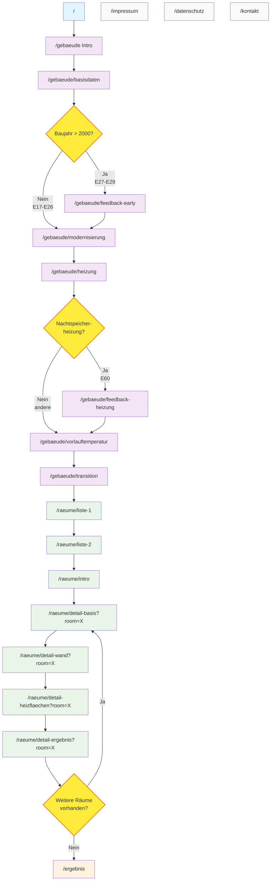

# UBA Wärmepumpen-Tool

Ein Online-Beratungstool für die Wärmepumpen-Eignung von Gebäuden.

## Projektübersicht

Das Wärmepumpen-Tool ist eine webbasierte Anwendung zur Analyse und Bewertung der Eignung von Gebäuden für Wärmepumpen. 
Es werden Gebäudeinformationen, Raumdaten und Heizkörperinformationen erfasst, um passende Wärmepumpen-Empfehlungen zu geben.

## Technische Details

- **Framework**: Angular 19.2.7
- **UI-Framework**: Bootstrap 5.3.3 mit Bootstrap Icons 1.11.3
- **Build-System**: Angular CLI 19.2.8
- **Hosting**: Express.js basierter Node.js Server

## Komponenten und Struktur

Das Tool folgt einem Wizard-Ansatz mit folgenden Hauptabschnitten:

1. **Gebäude**: Erfassung allgemeiner Gebäudedaten
2. **Räume**: Eingabe von raumspezifischen Daten
3. **Ergebnis**: Auswertung

## Entwicklungsumgebung einrichten

### Voraussetzungen

- Node.js (v20 oder höher)
- npm (wird mit Node.js installiert)
- LibreOffice (für Excel-Konvertierung)

### Installation

1. Repository klonen:
   ```bash
   git clone https://github.com/.../uba-waermepumpen.git
   cd uba-waermepumpen
   ```

2. Abhängigkeiten installieren:
   ```bash
   npm install
   ```

3. Entwicklungsserver starten:
   ```bash
   npm start
   ```
   Die Anwendung ist dann unter `http://localhost:4200/` erreichbar (`baseHref`-Konfiguration in angular.json).

## Build und Deployment

### Produktions-Build

```bash
npm run build
```

Die Build-Artefakte werden im `dist/uba-waermepumpen/` Verzeichnis erstellt.

Alternativ kann der gesamte Build-Prozess mit dem build.sh Script ausgeführt werden, welches zusätzlich **Version-Informationen** in die Build-Dateien einfügt:

```bash
./build.sh
```

## Projektstruktur

### Zentrale Services
- `src/app/berechnung.service.ts`: Zentraler Datenmanagement-Service mit DataGrid-Architektur
- `src/app/data-grid.ts`: Excel-kompatible Calculation Engine mit Sheets/Cells/Formeln
- `src/app/custom-local-storage.service.ts`: Erweiterte localStorage mit Type Safety
- `src/app/accordion.service.ts`: UI State Management für einklappbare Bereiche

### Formula Calculation System
- `src/app/formula-overlays/index.ts`: Zentrale Registry für alle Formula Overlays zum DataGrid
- `src/app/formula-overlays/base-overlay.ts`: Base Class und Utilities für Formula Overlays
- `src/app/formula-overlays/*-overlay.ts`: Excel-Formel-Übersetzungen pro Sheet (14 Overlay Classes)

### Component Architecture
- `src/app/gebaeude/`: Gebäudedaten-Erfassung Components (8 Components)
  - `gebaeude-basic/`: Grundlegende Gebäudeinformationen
  - `gebaeude-retrofitting/`: Gebäudesanierung Details
  - `gebaeude-heating/`: Heizsystem-Konfiguration
  - `gebaeude-flow-temp/`: Vorlauftemperatur-Einstellungen
- `src/app/raeume/`: Raumdaten-Erfassung Components (7 Components)
  - `raeume-intro/`: Raum-Erfassung Einführung
  - `raeume-list-criteria-*/`: Raum-Filterung und Listing
  - `raum-detail-*/`: Individuelle Raumkonfiguration (Basic, Walls, Heating, Results)
- `src/app/ergebnis/`: Ergebnis- und Assessment Components
  - `ergebnis-assessment/`: Wärmepumpen-Eignungsbewertung
- `src/app/shared/`: Wiederverwendbare UI Components
  - `wizard-tabs/`: Hauptnavigation mit Progress Indicators
  - `band-tacho/`: Gauge Visualization Component
  - `heater-form/`: Heizelement Configuration Form
  - `room-list/`: Room Selection und Management
  - `debug-overlay/`: Development Debugging Interface

### Auto-Generated Excel Data (20250507_WP_Check_Vorlage_ts_export/)
- `master.ts`: Central Export aller Excel Data
- `databaseRanges.ts`: Named Database Ranges aus Excel
- `explicitNamedRanges.ts`: Explizit definierte Named Ranges
- `namedExpressions.ts`: Named Formula Expressions
- **Calculation Sheets**: `clc_*.ts` - Formelbasierte Calculation Sheets
- **Input Sheets**: `IN_*.ts` - User Input Data Structures
- **Output Sheets**: `OUT_*.ts` - Berechnete Result Data
- **Reference Data**: `Daten.ts`, `U_Werte_*.ts`, `Data_radiator*.ts` - Lookup Tables und Constants
- **Legacy/Debug**: `Frontend_*_OLD.ts`, `Debug.ts`, `Todo.ts` - Development Artifacts

### Build und Configuration
- `build.sh`: Production Build Script mit Version Injection
- `xlsx-to-json.ts`: Excel zu TypeScript Conversion Tool
- `angular.json`: Angular CLI Configuration mit baseHref Setup

## Anwendungsrouten und Navigation

**Haupt-Workflow (Wizard-Pfad):**
```
/ (Start) → /gebaeude → /raeume → /ergebnis
```

### Routen

#### 1. Start und Einstieg
- `/` - **StartComponent**: Landing page

#### 2. Gebäude-Sektion (`/gebaeude/*`)
```
/gebaeude                    → GebaeudeIntroComponent (Einführung)
/gebaeude/basisdaten         → GebaeudeBasicComponent (PLZ, Typ, Baujahr)
/gebaeude/feedback-early     → GebaeudeFeedbackEarlyComponent (Erste Bewertung)
/gebaeude/modernisierung     → GebaeudeRetrofittingComponent (Sanierungsmaßnahmen)
/gebaeude/heizung           → GebaeudeHeatingComponent (Heizsystem-Details)
/gebaeude/feedback-heizung  → GebaeudeFeedbackHeatingComponent (Heizung-Bewertung)
/gebaeude/vorlauftemperatur → GebaeudeFlowTempComponent (Temperatur-Einstellungen)
/gebaeude/transition        → GebaeudeTransitionComponent (Übergang zu Räumen)
```

#### 3. Räume-Sektion (`/raeume/*`)
```
/raeume/liste-1             → RaeumeListCriteriaOneComponent (Raum-Kriterien 1)
/raeume/liste-2             → RaeumeListCriteriaTwoComponent (Raum-Kriterien 2)
/raeume/intro               → RaeumeIntroComponent (Raum-Einführung)
/raeume/detail-basis        → RaumDetailBasicComponent (Raum-Grunddaten)
/raeume/detail-wand         → RaumDetailWallsComponent (Wände und Verluste)
/raeume/detail-heizflaechen → RaumDetailHeizflaechenComponent (Heizflächen)
/raeume/detail-ergebnis     → RaumDetailErgebnisComponent (Raum-Ergebnis)
```

#### 4. Ergebnis
- `/ergebnis` - **ErgebnisAssessmentComponent**: Gesamtbewertung und Empfehlungen

#### 5. Statische Seiten
- `/impressum` - **ImpressumComponent**
- `/datenschutz` - **DatenschutzComponent**
- `/kontakt` - **KontaktComponent**

### Navigationsfluss-Diagramm




### Navigation-Features

#### Wizard-Tabs (WizardTabsComponent)
- **Haupttabs**: Gebäude | Räume | Ergebnis
- **Dynamische Raumtabs**: Werden automatisch für jeden erstellten Raum generiert
- **Raum-Subtabs**: Gebäude | Verluste | Heizflächen | Ergebnis (bei Raumbearbeitung)
- **Query-Parameter**: `?room=X` für raumspezifische Navigation

## Datenhaltung

Die Anwendung speichert Benutzereingaben in localStorage. Die Eingaben werden bei Änderungen automatisch gespeichert und beim Laden der Anwendung wiederhergestellt.

## Datenquellen und Excel-Konvertierung

Die Anwendung verwendet Excel-Tabellen als Datenquelle für Berechnungsmodelle und Referenzwerte. Diese werden mit einem Skript in TypeScript-Module konvertiert.

```bash
npx tsx xlsx-to-json.ts -i [Excel-Datei].xlsx -o [Ausgabeverzeichnis]
```

konkret:
```bash
npx tsx xlsx-to-json.ts -i *_Vorlage.xlsx -o 20250507_WP_Check_Vorlage_ts_export
```

Der Konvertierungsprozess:

1. Konvertiert die Excel-Datei temporär zu LibreOffice FODS Format
2. Extrahiert benannte Bereiche, Formeln und Datenbanktabellen
3. Liest alle Zellwerte und Formeln aus der Excel-Datei
4. Erstellt für jedes Arbeitsblatt ein TypeScript-Modul
5. Erstellt zusätzliche TS-Module für benannte Bereiche und Datenbanktabellen
6. Erzeugt eine `master.ts` Datei, die alle Module exportiert

Alle konvertierten Daten werden im Verzeichnis `[Excel-Dateiname]_ts_export` abgelegt und können direkt importiert werden.

